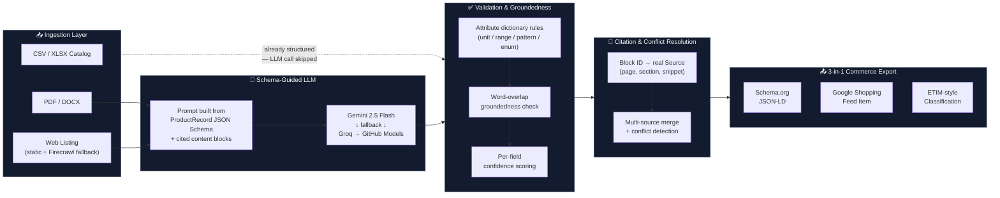

# PIVOT

### Product Intelligence & Validation for Optimized Trade

**Turn messy supplier PDFs, catalogs, and web listings into commerce-ready product data — with every field cited, scored, and validated. No hallucinated specs. No black box.**

[](https://pivot-hhifcq9kd-subhra-nandis-projects.vercel.app/)
[](https://pivot-backend-8ydb.onrender.com/health)
[](https://www.python.org/)
[](https://fastapi.tiangolo.com/)
[](https://react.dev/)
[](#quickstart--developer-setup)
[](https://ai.google.dev/)

> Built for the **Hack2Skill Hackathon** — Industrial Commerce track

---

## The Problem

Industrial e-commerce runs on dirty data. A supplier sends a PDF datasheet, a spreadsheet with inconsistent columns, or a product page that changes layout every quarter — and somewhere between "raw spec" and "live listing," someone has to manually retype voltage ratings, tensile strengths, and IP codes into a catalog. Get one digit wrong on a tensile strength spec, and it's not a typo — it's a procurement error that fails a part in the field.

Throwing an LLM at the problem doesn't fix this. It changes *who's* wrong — a model that confidently invents a plausible-looking spec is worse than a blank field, because a blank field gets checked and a hallucinated one doesn't.

## The Solution

**PIVOT ingests unstructured product data, extracts it with a schema-guided LLM, and then refuses to trust its own output** — every value is checked against physical unit rules, checked for whether it's actually grounded in the source text, cited down to the page and snippet it came from, and cross-checked against every other source that mentions the same product. What comes out the other end isn't a JSON blob you have to double-check — it's a record you can audit field-by-field, exported directly into the commerce feed formats procurement systems already expect.

---

## Core Engineering & Technical Differentiators

Most teams can get extraction working. The bet PIVOT makes is that **validation and explainability are the actual product** — here's what backs that up:

| # | Differentiator | What it actually does |
|---|---|---|
| 🔗 | **Resilient Fallback Chain** | One `LLMClient` interface, three providers behind it (Gemini → Groq → GitHub Models). A rate limit on one provider mid-demo doesn't take the pipeline down — it just moves to the next link in the chain, automatically. |
| 🧪 | **Groundedness Check** | Every extracted value is checked for word-overlap against the exact source block the model claims it came from. A value the model can't actually point to in the source gets demoted to `needs_review` — not silently trusted. |
| 📎 | **Citation Resolution** | The LLM cites a raw block ID during extraction (`b0007`); PIVOT resolves that into a real `Source` record with page number, section, and a verbatim text snippet — pulled from the actual document, not the model's paraphrase of it. |
| ⚖️ | **Multi-Source Conflict Engine** | Merge a PDF spec sheet and a scraped listing page for the same product, and if they disagree — `400 MPa` vs. `600 MPa` — both get flagged `needs_review` and recorded as a `Conflict`, with a one-click resolve-and-override in the UI. Nothing gets silently picked for you. |
| 📤 | **3-in-1 Commerce Exporter** | One validated internal record, mapped to **Schema.org** (JSON-LD), **Google Shopping** (feed spec), and **ETIM-style** industrial classification — each with its own structural validation, so you can *demonstrate* standards compliance, not just claim it. |

<details>
<summary><strong>Full validation & explainability stack (click to expand)</strong></summary>

- **Rule-based attribute validation** — SI unit conversion (`base_unit_of`, `convert_to_base`) plus pattern/range/enum checks per attribute, driven by a shared attribute dictionary so Phase 4 (validation) and Phase 6 (commerce export) can never silently disagree on what a valid `voltage_rating` looks like.
- **Per-field confidence, not per-record** — a website-sourced field is scored differently than a document-sourced one; `overall_confidence` is a real rollup, not a placeholder.
- **Idempotent citation resolution** — calling the resolver twice on the same record is a safe no-op; catalog-sourced records (already correctly cited at creation) pass through untouched.
- **194 automated tests**, zero network/LLM calls required to run them — every provider SDK call is mocked or stubbed, so `pytest -q` is fully deterministic and safe to run anywhere, including a venue with no wifi.

</details>

---

## Visual Architecture



**Why CSV/XLSX skips the LLM entirely:** a spreadsheet is already structured — mapping columns straight to a `ProductRecord` is faster, cheaper, and has zero hallucination risk compared to routing already-clean data through a model. The LLM is reserved for the two source types that actually need it: unstructured documents and web pages.

---

## API & Data Quick Look

<details open>
<summary><strong>Raw input</strong> — one paragraph from a real PDF spec sheet</summary>

```text
ACS37800 Power Meter Module
Supply Voltage: 5V. Current Rating: 7.6A. IP Rating: IP65.
```

</details>

<details open>
<summary><strong>Verified output</strong> — <code>POST /extract/file</code></summary>

```json
{
  "product_record": {
    "product_name": "ACS37800 Power Meter Module",
    "brand": "SparkFun",
    "specifications": [
      {
        "attribute": "voltage_rating",
        "value": "5V",
        "unit": "V",
        "confidence": 0.95,
        "status": "extracted",
        "source": {
          "type": "document",
          "reference": "src-2",
          "snippet": "Supply Voltage: 5V. Current Rating: 7.6A. IP Rating: IP65."
        }
      }
    ],
    "validation": {
      "overall_confidence": 0.82,
      "conflicts": []
    },
    "provenance": {
      "sources_used": [
        { "id": "src-2", "type": "document", "reference": "acs37800_datasheet.pdf", "page": 1 }
      ]
    }
  },
  "commerce": {
    "schema_org":       { "document": { "...": "JSON-LD" }, "issues": [] },
    "google_shopping":  { "document": { "...": "feed item" }, "issues": ["recommended: image is missing"] },
    "industrial":       { "document": { "...": "ETIM-style" }, "issues": [] }
  }
}
```

Notice `source.reference` points at a real `Source` in `provenance.sources_used` — not a raw model claim. Click through it, and you get back the actual page and the actual snippet the value was pulled from.

</details>

---

## Quickstart & Developer Setup

```bash
# 1. Clone
git clone https://github.com/Subhra-Nandi/PIVOT.git
cd PIVOT

# 2. Configure environment
cp backend/.env.example backend/.env
# fill in GEMINI_API_KEY at minimum — Groq/GitHub Models are optional fallbacks

# 3. Verify
cd backend
python -m venv .venv && source .venv/bin/activate   # Windows: .venv\Scripts\Activate.ps1
pip install -r requirements.txt
pytest -q
```

Expect `194 passed` — zero network calls required, every LLM call in the test suite is mocked.

<details>
<summary><strong>Run the full stack locally</strong></summary>

```bash
# Backend (from backend/, venv active)
uvicorn app.main:app --reload --port 8000

# Frontend (separate terminal)
cd frontend
npm install
echo "VITE_API_BASE_URL=http://localhost:8000" > .env.local
npm run dev
```

</details>

<details>
<summary><strong>⚠️ Render free-tier cold starts</strong></summary>

The live backend (`pivot-backend-8ydb.onrender.com`) runs on Render's free tier, which **spins down after 15 minutes of inactivity**. The first request after a period of idle time triggers a cold start that can take 30–60 seconds before the API responds — this is infrastructure behavior, not a bug in the pipeline. If you're demoing live, hit `/health` a minute or two beforehand to warm the container up, and lead with the CSV/catalog demo (no LLM call, always fast) before a PDF extraction.

</details>

---

## Business Impact & ROI

| Metric | Before PIVOT | With PIVOT |
|---|---|---|
| **Catalog onboarding time per SKU** | Hours to days (manual transcription + review) | Seconds to minutes |
| **Spec traceability** | "Someone typed this in" | Exact page, section, and snippet, per field |
| **Cross-source disagreement** | Silently picked by whoever entered it last | Explicitly flagged, side-by-side, human-resolved |
| **Commerce feed compliance** | Manually re-formatted per channel | Auto-mapped to 3 standards, validated on export |
| **Hallucinated spec risk** | Unbounded (nothing checks the LLM) | Grounded against source text or flagged `needs_review` |

**The real cost this targets isn't the labor of retyping a spec sheet — it's the procurement error that happens when nobody catches a wrong one.** A tensile strength off by 200 MPa isn't a data quality nit; it's a part that fails under load. PIVOT's bet is that the validation layer is worth more than the extraction layer, because extraction without validation just moves the error from a human's keyboard to a model's hallucination — same risk, faster.

---

## Hackathon & Team Credits

<div align="center">

### 🏆 Built for the Hack2Skill Hackathon

</div>

| Contributor | GitHub |
|---|---|
| **Subhra Nandi** | [@Subhra-Nandi](https://github.com/Subhra-Nandi) |
| **Sneha Paul** | [@sneha-paul-2005](https://github.com/sneha-paul-2005) |
| **Sayan** | [@sayan1506](https://github.com/sayan1506) |
| **Somsubhra Nandi** | [@Somsubhra-Nandi](https://github.com/Somsubhra-Nandi) |

---

<div align="center">

**[Live App](https://pivot-hhifcq9kd-subhra-nandis-projects.vercel.app/)** · **[API Health](https://pivot-backend-8ydb.onrender.com/health)** · **[Repository](https://github.com/Subhra-Nandi/PIVOT)**

</div>